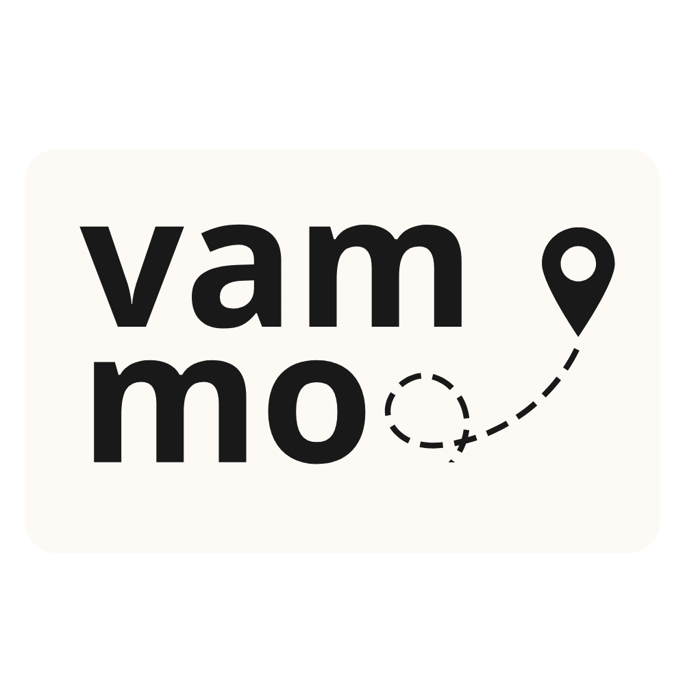
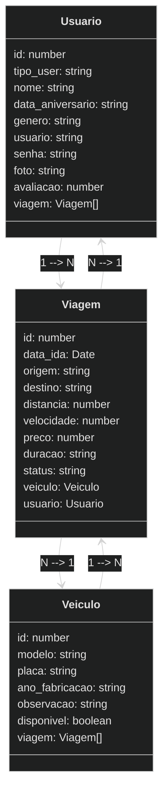

<div align="center">
    
</div>

---

# Vammo ↩🚘
## Backend para Aplicativo de Carona Compartilhada

## 1. Descrição

O projeto **Vammo** é o desenvolvimento de um backend robusto e escalável para um aplicativo de carona compartilhada. Utilizando TypeScript e o framework NestJS, o sistema visa proporcionar uma experiência eficiente e segura para a administração do catálogo de viagens, usuários e veículos, com foco em facilidade de uso e controle de informações.

---

## 2. Funcionalidades do Projeto

### 2.1 Gerenciamento de Viagens

- Permite adicionar novas viagens ao sistema com as seguintes informações:
  - ID
  - Origem
  - Destino
  - Data e hora da ida
  - Preço da viagem
  - Distância entre origem e destino
  - Status da viagem
  - Veículo
  - Usuário

- **Consulta de Viagem:**
  - Listagem de todas as viagens.
  - Busca por ID.
  - Visualização de cálculo do tempo da viagem com base na distância e na velocidade média do veículo.

- **Atualização de Viagem:**
  - Altera a origem, destino, data da ida, preço, distância, status e nota de uma viagem existente e veículo.

### 2.2 Gerenciamento de Veículos

- Permite adicionar novos veículos ao sistema com as seguintes informações:
  - ID
  - Modelo
  - Placa
  - Ano de fabricação
  - Observação
  - Disponibilidade

- **Consulta de Veículos:**
  - Busca avançada por modelo, placa, ano de fabricação, observação e disponibilidade.
  - Visualização detalhada do perfil de um veículo.

- **Atualização de Dados:**
  - Alterar modelo, placa, ano de fabricação, observação e disponibilidade.

### 2.3 Gerenciamento de Usuários

- Permite adicionar novos usuários ao sistema com as seguintes informações:
  - ID
  - Tipo de usuário
  - Nome
  - Data de aniversário
  - Gênero
  - Usuário
  - Senha
  - Foto
  - Avaliação do motorista

- **Consulta de Usuários:**
  - Busca avançada por nome, gênero e usuário.
  - Visualização detalhada do perfil de um usuário.

- **Atualização de Dados:**
  - Alterar informações cadastrais, como nome, usuário ou foto.

---

## 3. Sobre esta API

O **NestJS** é uma estrutura para a construção de aplicativos Node.js do lado do servidor eficientes e escalonáveis. Ele usa JavaScript progressivo, é construído com TypeScript (mas também suporta JavaScript puro) e combina elementos de OOP (Programação Orientada a Objetos), FP (Programação Funcional) e FRP (Programação Funcional Reativa).

Nos bastidores, o Nest utiliza estruturas robustas de servidor HTTP como o **Express** (padrão) e, opcionalmente, **Fastify**.

### 3.1 Principais Funcionalidades

- Estrutura modular
- Suporte a TypeScript
- Injeção de dependências
- Testes facilitados
- Controllers e rotas
- Validação e serialização
- Integração com bibliotecas externas

---

## 4. Diagrama de Classes



---

## 5. Diagrama Entidade-Relacionamento (DER)

<div align="center">
    
</div>

---

## 6. Tecnologias Utilizadas

| Item                          | Descrição  |
| ----------------------------- | ---------- |
| **Servidor**                  | Node.js    |
| **Linguagem de Programação**  | TypeScript |
| **Framework**                 | NestJS     |
| **ORM**                       | TypeORM    |
| **Banco de Dados Relacional** | MySQL      |
| **Deploy**                    | Swagger, Render |

---

## 7. Configuração e Execução

1. Clone o repositório:
   ```sh
   git clone https://github.com/projetointegrador-g3/vammo.git
   ```
2. Acesse o diretório do projeto:
   ```sh
   cd vammo
   ```
3. Instale as dependências:
   ```sh
   npm install
   ```
4. Configure o banco de dados no arquivo `app.module.ts`.
5. Execute a aplicação:
   ```sh
   npm run start:dev
   ```

---

## 8. Colaboradores

- `@ZarathosFreya`
- `@Beatriz-Rodrigues-P`
- `@brunop-lima`
- `@emilyestvz`
- `@fern-menezes`
- `@Josadack`
- `@VictorPestana`
