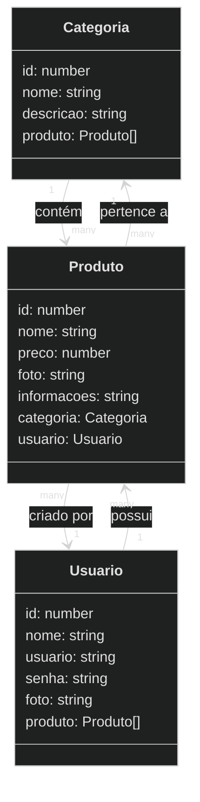

# DishDash - Backend 

 

    

  

## 1. Descrição

O projeto **DishDash** é o desenvolvimento de um backend robusto e escalável para um e-commerce de alimentos. Utilizando **TypeScript** e o framework **NestJS**, o sistema visa proporcionar uma experiência **eficiente e segura** para a administração do catálogo de produtos, usuários e categorias, com foco em facilidade de uso e controle de informações.

- ### Funcionalidades do projeto

  1. **Gerenciamento de Categorias**:
     - Permite adicionar novas categorias ao sistema com as seguintes informações:
       - **ID**
       - **Nome**
       - **Descrição**
     - Consulta de Categorias:
       - Listagem de todas categorias.
       - Busca por nome e descrição.
     - Atualização de Dados:
       - Alterar nome ou descrição de uma categoria existente.
  2. **Gerenciamento de Produtos**:
     - Permite adicionar novos produtos ao sistema com as seguintes informações:
       - **ID**
       - **Nome**
       - **Preço**
       - **Foto**
       - **Informações**
       - **Categoria**
       - **Usuário**
     - Consulta de Produtos:
       - Busca avançada por nome, categoria e preço.
       - Visualização detalhada do perfil de um produto.
     - Atualização de Dados:
       - Alterar nome, preço, informações ou foto do produto.
  3. **Gerenciamento de Usuários**:
     - Permite adicionar novos usuários ao sistema com as seguintes informações:
       - **ID**
       - **Nome**
       - **Usuário**
       - **Senha**
       - **Foto**
     - Consulta de Usuários:
       - Busca avançada por nome e usuário.
       - Visualização detalhada do perfil de um usuário.
     - Atualização de Dados:
       - Alterar informações cadastrais, como nome, usuário ou foto.

------

 

## 2. Sobre esta API

<strong>Nest (NestJS)</strong> é uma estrutura para a construção de aplicativos Node.js do lado do servidor eficientes e escalonáveis. Ele usa JavaScript progressivo, é construído e oferece suporte total a TypeScript (mas ainda permite que os desenvolvedores codifiquem em JavaScript puro) e combina elementos de OOP (Programação Orientada a Objetos), FP (Programação Funcional) e FRP (Programação Funcional Reativa).
Nos bastidores, o Nest faz uso de estruturas robustas de servidor HTTP como o Express (o padrão) e, opcionalmente, pode ser configurado para usar o Fastify também!

O Nest fornece um nível de abstração acima desses Node.js comuns frameworks (Express/Fastify), mas também expõe suas APIs diretamente ao desenvolvedor. Isso dá aos desenvolvedores a liberdade de usar uma infinidade de módulos de terceiros disponíveis para a plataforma subjacente.

### 2.1. Principais Funcionalidades

- Estrutura Modular
- Suporte a TypeScript
- Injeção de dependências
- Testes facilitados
- Controlleres e Rotas
- Validação e serialização
- Integração com bibliotecas externas

------

 

## 3. Diagrama de Classes

# 

---

------

 

## 4. Diagrama Entidade-Relacionamento (DER)

    

------

 

## 5. Tecnologias utilizadas

| Item                          | Descrição  |
| ----------------------------- | ---------- |
| **Servidor**                  | Node JS    |
| **Linguagem de programação**  | TypeScript |
| **Framework**                 | Nest JS    |
| **ORM**                       | TypeORM    |
| **Banco de dados Relacional** | MySQL      |

------

 

## 6. Configuração e Execução

1. Clone o repositório
2. Instale as dependências: `npm install`
3. Configure o banco de dados no arquivo `app.module.ts`
4. Execute a aplicação: `npm run start:dev`

------

 

## 7. Colaboradores

`@ZarathosFreya`
`@Beatriz-Rodrigues-P`
`@brunop-lima`
`@emilyestvz`
`@fern-menezes`
`@Josadack`
`@VictorPestana`
